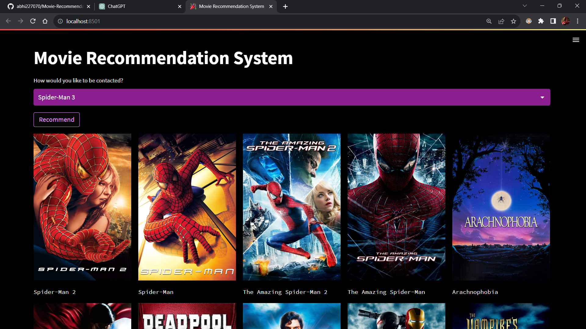
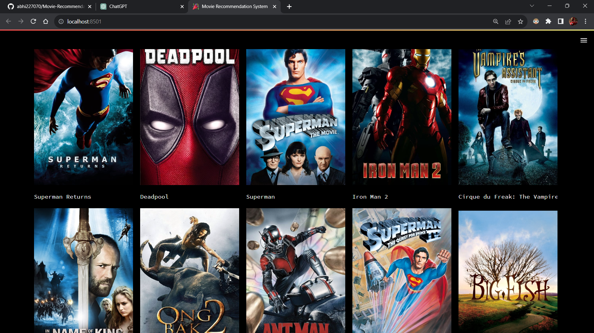
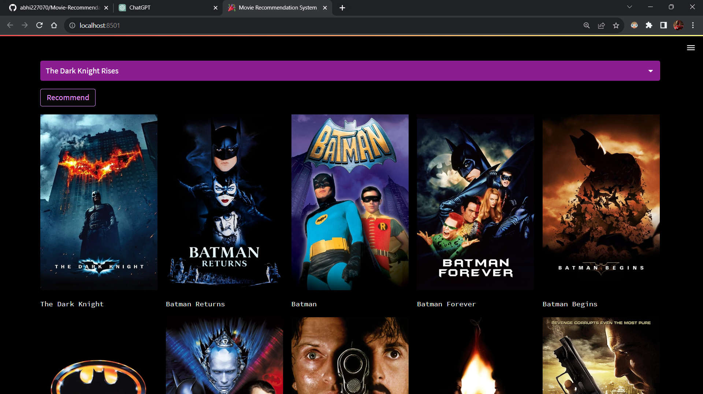
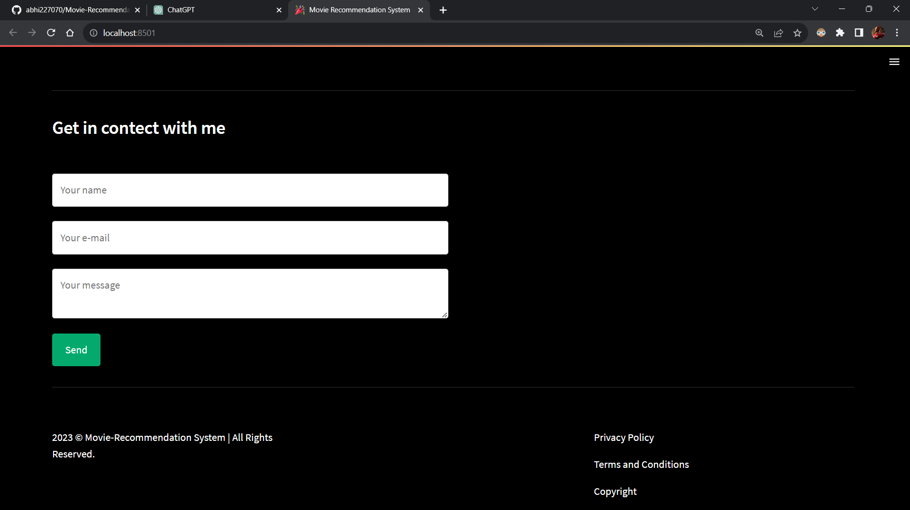
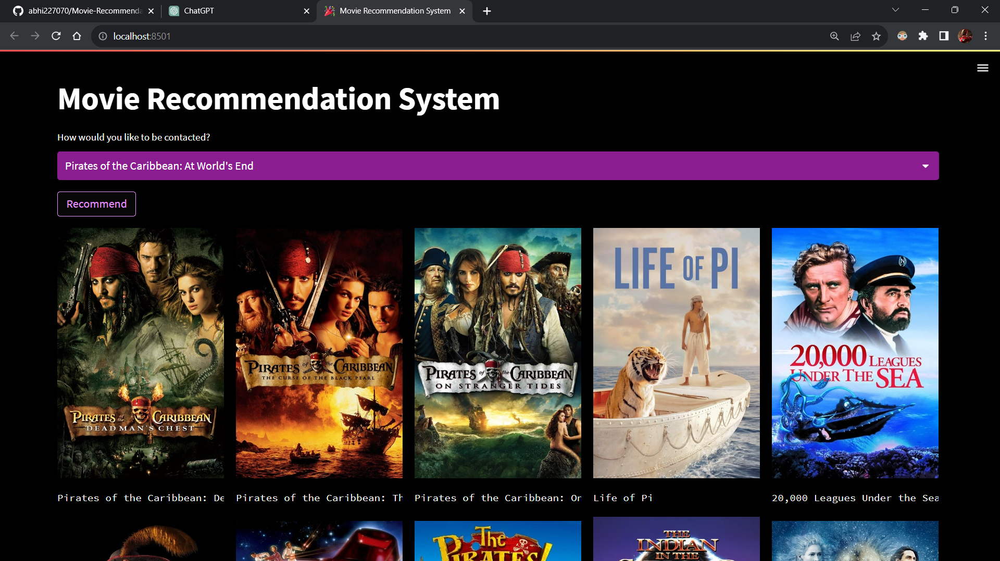

# Movie Recommendation System

## Introduction

The Movie Recommendation System is an advanced machine learning project developed in Python, aimed at providing tailored movie suggestions to users based on their preferences and viewing habits. Leveraging various machine learning algorithms and data processing techniques, this system offers a personalized and enriched movie-watching experience.

## Project Overview

The project encompasses a comprehensive workflow:

### Data Collection and Analysis

The journey commences with the acquisition of a diverse movie dataset obtained from Kaggle. Through meticulous data analysis and exploration, insightful patterns, trends, and statistical information about the movies and their attributes are uncovered. Visual representations aid in understanding the dataset's characteristics.

### Feature Engineering and Model Building

The dataset undergoes extensive feature engineering, where irrelevant attributes are eliminated, categorical features are processed, and text data undergoes meticulous preprocessing. These steps are vital in transforming raw data into a structured and informative format.

With the transformed dataset, sophisticated machine learning models are constructed. Text data is converted into numerical vectors using TF-IDF Vectorization. Utilizing these vectors, a robust recommendation system is built employing cosine similarity to identify similarities between movies and provide accurate recommendations based on user preferences.

### GUI Development and Deployment

The project culminates in a user-friendly graphical interface created using the Streamlit library in VS Code. This interface seamlessly integrates the recommendation model. Through this interface, users can input their preferences and receive personalized movie recommendations instantly.

The deployment aspect involves the use of Docker for containerization, ensuring consistent behavior across different environments. Leveraging the Render cloud platform, the web application is deployed, making it accessible to users through a server.

## Project Images

### Image Description

The images above encapsulate different stages of the project, portraying the data collection and analysis phase, feature engineering, model building, GUI development, and the deployment process.

## Usage

To utilize the Movie Recommendation System:

1. Clone this repository.
2. Install the required dependencies.
3. Run the application using Streamlit.

## License

This project is licensed under the MIT License. See the [LICENSE](link_to_license_file) file for details.

## Contact

For any inquiries or questions regarding the project, feel free to contact [Abhijeet Maharana](mailto:abhijeetmaharana77@gmail.com).
